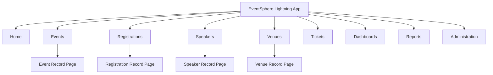

# Application Navigation & User Experience (UX) Design

## Project Information

**Project Name:** EventSphere Salesforce Implementation

**Sprint:** Sprint 2 – Solution Architecture & Data Model

**Scenario:** Scenario 12 – Application Navigation & User Experience Design

---

# Business Overview

With the solution architecture, data model, and security model finalized, the next step is to design how users will interact with the EventSphere application. The objective is to provide an intuitive, role-based Lightning Experience that improves productivity while minimizing unnecessary navigation.

The UX design ensures that every department can quickly access the information and functionality required for their daily responsibilities.

---

# Lightning Application

| Property | Value |
|----------|-------|
| Application Name | EventSphere |
| Developer Name | EventSphere |
| Type | Lightning App |
| Description | Centralized Event Management Platform |

---

# Navigation Menu

The EventSphere Lightning App will contain the following primary navigation items:

```text
🏠 Home
📅 Events
📝 Registrations
🎤 Speakers
📍 Venues
🎫 Tickets
📊 Dashboards
📈 Reports
⚙️ Administration
```

### Navigation Design Principles

- Frequently used objects appear first.
- Administrative features are separated from business operations.
- Navigation remains consistent across departments.
- Unnecessary tabs are hidden based on user permissions.

---

# Home Page Design

## Event Manager Dashboard

Components displayed:

- Upcoming Events
- Draft Events
- Recently Modified Events
- Pending Approvals
- Capacity Alerts

---

## Registration Executive Dashboard

Components displayed:

- Today's Registrations
- Registration Status
- Waitlisted Attendees
- Recent Check-ins

---

## Finance Dashboard

Components displayed:

- Revenue Summary
- Pending Payments
- Refund Requests
- Financial Reports

---

## Executive Dashboard

Components displayed:

- Total Events
- Active Registrations
- Revenue Overview
- Attendance Percentage
- Customer Satisfaction Metrics

---

# Utility Bar

The Utility Bar will provide quick access to commonly used tools.

| Utility | Purpose |
|---------|---------|
| Notes | Quick note-taking |
| Recent Records | Access recently viewed records |
| History | Navigation history |
| Softphone (Future) | Integrated calling |
| Omni-Channel (Future) | Case routing and support |

---

# Record Page Strategy

## Event Record Page

Tabs:

```text
Details
Related
Sessions
Registrations
Files
Activity
```

---

## Registration Record Page

Tabs:

```text
Details
Payment
Activity
Files
```

---

## Speaker Record Page

Tabs:

```text
Details
Assigned Sessions
Activity
```

---

## Venue Record Page

Tabs:

```text
Details
Related Events
Files
Activity
```

---

# Department Navigation

## Event Manager

Primary Navigation:

- Home
- Events
- Sessions
- Speakers
- Venues
- Dashboards
- Reports

---

## Registration Executive

Primary Navigation:

- Home
- Registrations
- Events
- Reports

---

## Finance Manager

Primary Navigation:

- Home
- Registrations
- Revenue Reports
- Dashboards

---

## Marketing Executive

Primary Navigation:

- Home
- Events
- Sponsors
- Dashboards
- Reports

---

## Speaker Coordinator

Primary Navigation:

- Home
- Speakers
- Sessions
- Events

---

## Executive Management

Primary Navigation:

- Home
- Dashboards
- Reports

---

## System Administrator

Primary Navigation:

- Home
- Administration
- Users
- Permission Sets
- Reports
- Setup

---

# User Experience Principles

The EventSphere application follows these UX principles:

## 1. Keep Navigation Simple

Users should access common tasks within a few clicks.

---

## 2. Show Only Relevant Information

Departments should only see objects and features required for their work.

---

## 3. Minimize Clicks

Frequently used actions should be easily accessible.

---

## 4. Surface Important Information First

Dashboards and alerts should appear prominently on Home pages.

---

## 5. Maintain Consistency

Record pages should follow a consistent layout across objects.

---

## 6. Dashboard-First Approach

Users should rely on dashboards for operational insights instead of manually generating reports.

---

# Future UX Improvements

The following enhancements are planned for future releases:

- Mobile-optimized navigation.
- Dark Mode support.
- AI Assistant using Einstein Copilot.
- Interactive Event Calendar.
- QR Code Check-in Screen.
- Personalized Home Pages.
- Voice-enabled navigation.
- Smart recommendations for upcoming tasks.

---

# UX Design Assumptions

The following assumptions have been made:

- Users primarily access EventSphere through Lightning Experience.
- Navigation will be customized based on Profiles and Permission Sets.
- Record pages will use Dynamic Forms where supported.
- Future Lightning Web Components will integrate seamlessly into the planned page layouts.
- Home pages will be role-specific.

---

# Application Navigation Diagram



---

# Implementation Readiness Checklist

| Activity | Status |
|----------|--------|
| Lightning App Designed | ✅ |
| Navigation Menu Defined | ✅ |
| Home Pages Planned | ✅ |
| Utility Bar Planned | ✅ |
| Record Pages Designed | ✅ |
| Department Navigation Documented | ✅ |
| UX Principles Defined | ✅ |
| Ready for Salesforce Configuration | ✅ |

---

# Summary

This Application Navigation & UX Design document defines how users will interact with the EventSphere Salesforce application. It establishes the Lightning App structure, navigation menu, home pages, record page layouts, utility bar configuration, department-specific navigation, and future user experience enhancements. Together with the Solution Architecture, Data Models, and Security Architecture, this document completes the architectural foundation required before beginning Salesforce configuration in Sprint 3.