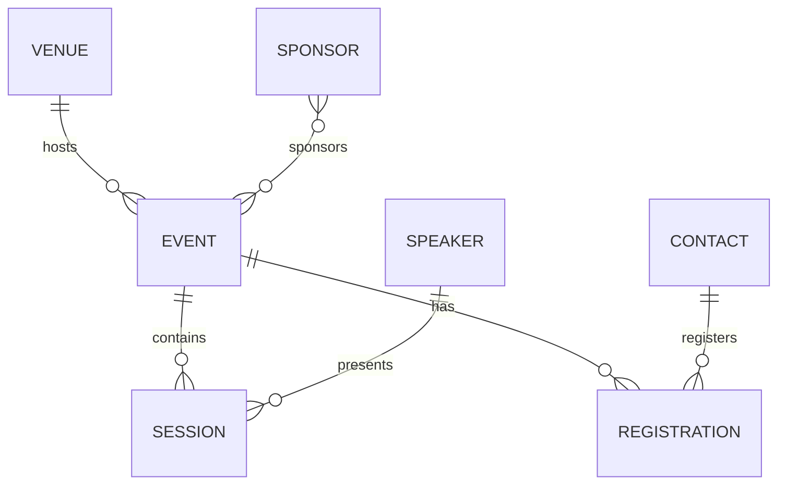

# Logical Data Model & Relationship Design

## Project Information

**Project Name:** EventSphere Salesforce Implementation

**Sprint:** Sprint 2 – Solution Architecture & Data Model

**Scenario:** Scenario 9 – Logical Data Model & Relationship Design

---

# Business Overview

Following the completion of the Conceptual Data Model, the next step is to define the logical relationships between the identified business entities. This document establishes how objects interact with one another, the business rules governing those relationships, and the reporting implications. These decisions will guide the implementation of Salesforce relationships in subsequent scenarios.

---

# Business Entities

The logical data model includes the following business entities:

- Event
- Session
- Registration
- Speaker
- Venue
- Ticket
- Sponsor
- Feedback
- Contact
- Account
- User

---

# Logical Relationship Model

## Event → Session

| Attribute | Value |
|----------|-------|
| Parent Object | Event |
| Child Object | Session |
| Cardinality | One-to-Many (1:N) |
| Proposed Relationship | Master-Detail |
| Business Rule | One Event contains multiple Sessions. Every Session belongs to exactly one Event. |
| Reporting Impact | Enables event schedules and roll-up summaries. |

---

## Event → Registration

| Attribute | Value |
|----------|-------|
| Parent Object | Event |
| Child Object | Registration |
| Cardinality | One-to-Many (1:N) |
| Proposed Relationship | Master-Detail |
| Business Rule | One Event can have many Registrations. Every Registration belongs to one Event. |
| Reporting Impact | Supports attendee counts and registration analytics. |

---

## Contact → Registration

| Attribute | Value |
|----------|-------|
| Parent Object | Contact |
| Child Object | Registration |
| Cardinality | One-to-Many (1:N) |
| Proposed Relationship | Master-Detail |
| Business Rule | One Contact may register for multiple Events. |
| Reporting Impact | Supports attendee history and repeat participation reporting. |

---

## Speaker → Session

| Attribute | Value |
|----------|-------|
| Parent Object | Speaker |
| Child Object | Session |
| Cardinality | One-to-Many (1:N) |
| Proposed Relationship | Lookup |
| Business Rule | One Speaker may present multiple Sessions. Each Session has one primary Speaker. |
| Reporting Impact | Enables speaker workload and session reports. |

---

## Venue → Event

| Attribute | Value |
|----------|-------|
| Parent Object | Venue |
| Child Object | Event |
| Cardinality | One-to-Many (1:N) |
| Proposed Relationship | Lookup |
| Business Rule | One Venue hosts multiple Events over time. Each Event is scheduled at one Venue. |
| Reporting Impact | Supports venue utilization reporting. |

---

## Sponsor ↔ Event

| Attribute | Value |
|----------|-------|
| Parent Object | Sponsor |
| Child Object | Event |
| Cardinality | Many-to-Many (N:N) |
| Proposed Relationship | Junction Object (Future) |
| Business Rule | Sponsors may support multiple Events, and Events may have multiple Sponsors. |
| Reporting Impact | Sponsorship reporting and ROI analysis. |

---

# Junction Objects

## Registration

Registration acts as the junction object between:

- Contact
- Event

This resolves the many-to-many relationship where:

- One Contact may attend many Events.
- One Event may contain many Contacts.

---

## Future Sponsorship Junction

A future Sponsorship junction object may be introduced to support:

- Sponsorship Level
- Sponsorship Amount
- Contract Details
- Marketing Benefits

---

# Relationship Matrix

| Parent | Child | Cardinality | Proposed Relationship | Business Justification |
|--------|-------|-------------|-----------------------|------------------------|
| Event | Session | 1:N | Master-Detail | Sessions depend on Events |
| Event | Registration | 1:N | Master-Detail | Registrations cannot exist without Events |
| Contact | Registration | 1:N | Master-Detail | Registration belongs to one attendee |
| Speaker | Session | 1:N | Lookup | Speakers exist independently |
| Venue | Event | 1:N | Lookup | Venues can exist before Events |
| Sponsor | Event | N:N | Junction Object (Future) | Multiple Sponsors per Event |

---

# Relationship Decisions

The architecture team agreed on the following decisions:

- Session records are dependent on Event records.
- Registration is the central transaction object connecting attendees and events.
- Speaker records remain independent because they may exist before session assignment.
- Venue records remain reusable across multiple events.
- Sponsorship tracking will initially remain simple, with detailed many-to-many implementation planned for future releases.
- Relationships should support reporting, automation, and scalability while minimizing data redundancy.

---

# Reporting Implications

The logical relationship model enables reporting such as:

- Total registrations per Event.
- Sessions conducted for each Event.
- Speaker session counts.
- Venue utilization reports.
- Repeat attendee analysis.
- Future sponsorship analytics.

---

# Future Design Considerations

The following enhancements have been identified for future releases:

- Sponsorship junction object.
- Multiple speakers for a single session.
- Hybrid and virtual venues.
- Session prerequisites.
- Event series and recurring events.
- Cross-event attendee analytics.
- Advanced sponsorship management.

---

# Risks

Potential risks include:

- Incorrect relationship selection affecting automation.
- Overuse of Master-Detail relationships limiting flexibility.
- Future reporting requirements introducing additional relationship complexity.
- Evolving business requirements requiring new junction objects.

---

# Design Assumptions

The following assumptions have been made:

- Each Session belongs to one Event.
- Each Registration references one Event and one Contact.
- Speakers may present multiple Sessions.
- Venues remain reusable across multiple Events.
- Sponsorship requirements may expand after MVP delivery.

---

# Mermaid Relationship Diagram

---

# Summary

This Logical Data Model defines how the core business entities within EventSphere relate to one another. It establishes cardinality, identifies candidate Master-Detail and Lookup relationships, introduces junction objects where required, and documents the architectural decisions that will guide Salesforce implementation. This logical model serves as the blueprint for the Physical Data Model, where these relationships will be translated into actual Salesforce object relationships and metadata.