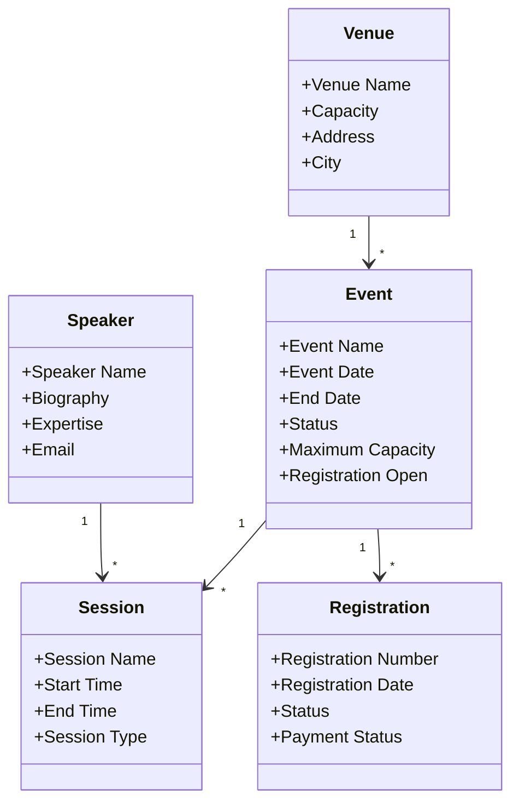

# Physical Data Model & Salesforce Object Design

## Project Information

**Project Name:** EventSphere Salesforce Implementation

**Sprint:** Sprint 2 – Solution Architecture & Data Model

**Scenario:** Scenario 10 – Physical Data Model & Salesforce Object Design

---

# Business Overview

Following the approval of the Logical Data Model, the project now enters the Physical Data Modeling phase. This document defines how each business entity will be represented as a Salesforce object, including object properties, planned fields, ownership, and naming conventions.

The Physical Data Model serves as the implementation blueprint for Sprint 3, where Salesforce configuration will begin.

---

# Object Specifications

## 1. Event

| Property | Value |
|----------|-------|
| Label | Event |
| API Name | Event__c |
| Plural Label | Events |
| Record Name | Event Name |
| Record Name Type | Text |
| Owner Department | Event Operations |
| Description | Stores information related to business events managed through the EventSphere platform. |

### Planned Fields

| Field Label | API Name | Data Type | Required |
|-------------|----------|-----------|----------|
| Event Date | Event_Date__c | Date | Yes |
| End Date | End_Date__c | Date | Yes |
| Status | Status__c | Picklist | Yes |
| Maximum Capacity | Maximum_Capacity__c | Number | Yes |
| Registration Open | Registration_Open__c | Checkbox | Yes |
| Description | Description__c | Long Text Area | No |

---

## 2. Session

| Property | Value |
|----------|-------|
| Label | Session |
| API Name | Session__c |
| Plural Label | Sessions |
| Record Name | Session Name |
| Record Name Type | Text |
| Owner Department | Event Operations |
| Description | Represents an individual session conducted as part of an Event. |

### Planned Fields

| Field Label | API Name | Data Type | Required |
|-------------|----------|-----------|----------|
| Start Time | Start_Time__c | Date/Time | Yes |
| End Time | End_Time__c | Date/Time | Yes |
| Session Type | Session_Type__c | Picklist | Yes |
| Room | Room__c | Text | No |

---

## 3. Registration

| Property | Value |
|----------|-------|
| Label | Registration |
| API Name | Registration__c |
| Plural Label | Registrations |
| Record Name | Registration Number |
| Record Name Type | Auto Number |
| Auto Number Format | REG-{00000} |
| Owner Department | Registration Team |
| Description | Represents an attendee's registration for an Event. |

### Planned Fields

| Field Label | API Name | Data Type | Required |
|-------------|----------|-----------|----------|
| Registration Date | Registration_Date__c | Date | Yes |
| Status | Status__c | Picklist | Yes |
| Check-in Status | Check_In_Status__c | Checkbox | No |
| Payment Status | Payment_Status__c | Picklist | Yes |

---

## 4. Speaker

| Property | Value |
|----------|-------|
| Label | Speaker |
| API Name | Speaker__c |
| Plural Label | Speakers |
| Record Name | Speaker Name |
| Record Name Type | Text |
| Owner Department | Event Operations |
| Description | Stores information about event speakers. |

### Planned Fields

| Field Label | API Name | Data Type | Required |
|-------------|----------|-----------|----------|
| Biography | Biography__c | Long Text Area | No |
| Expertise | Expertise__c | Picklist | Yes |
| Email | Email__c | Email | Yes |
| Phone | Phone__c | Phone | No |

---

## 5. Venue

| Property | Value |
|----------|-------|
| Label | Venue |
| API Name | Venue__c |
| Plural Label | Venues |
| Record Name | Venue Name |
| Record Name Type | Text |
| Owner Department | Event Operations |
| Description | Stores venue information for business events. |

### Planned Fields

| Field Label | API Name | Data Type | Required |
|-------------|----------|-----------|----------|
| Capacity | Capacity__c | Number | Yes |
| Address | Address__c | Text Area | Yes |
| City | City__c | Text | Yes |
| State | State__c | Text | Yes |
| Country | Country__c | Text | Yes |

---

# Naming Standards

The following naming standards will be followed throughout the implementation.

## Object Naming

- Labels use business-friendly names.
- Custom object API names end with `__c`.
- Object names should be singular.

Examples:

- Event
- Registration
- Session
- Speaker

---

## Field Naming

- Field labels use Title Case.
- API Names use underscores.
- API names end with `__c`.

Example:

| Label | API Name |
|--------|----------|
| Event Date | Event_Date__c |
| Maximum Capacity | Maximum_Capacity__c |

---

## Picklist Standards

Picklist values must use controlled business values.

Example Event Status:

- Draft
- Published
- Registration Open
- Registration Closed
- Completed
- Cancelled

---

## Documentation Standards

Every object should contain:

- Business Description
- Owner Department
- Planned Fields
- Implementation Notes

---

# Design Assumptions

The following assumptions have been made during physical design.

- Event names should be unique within the same calendar year.
- Registration Numbers will be generated automatically.
- Session dates must fall within the Event duration.
- Capacity cannot be negative.
- Required fields will be enforced through validation during implementation.
- Future integrations may require additional external ID fields.

---

# Implementation Readiness Checklist

| Item | Status |
|------|--------|
| Object Inventory Approved | ✅ |
| Logical Relationships Approved | ✅ |
| Object Names Defined | ✅ |
| API Names Defined | ✅ |
| Planned Fields Defined | ✅ |
| Naming Standards Defined | ✅ |
| Ready for Salesforce Configuration | ✅ |

---

# Physical Data Model Diagram

---

# Summary

This Physical Data Model defines the Salesforce object specifications required for the EventSphere implementation. It establishes object properties, field definitions, naming standards, ownership, implementation assumptions, and physical relationships. This document provides a detailed implementation blueprint that will guide Salesforce configuration activities beginning in Sprint 3 while maintaining consistency across development, testing, and future enhancements.