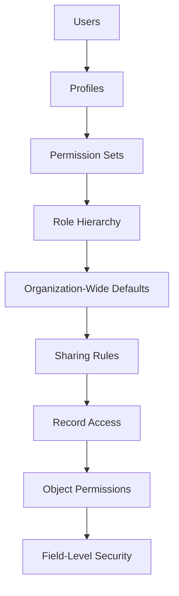

# Security Architecture & Access Control Design

## Project Information

**Project Name:** EventSphere Salesforce Implementation

**Sprint:** Sprint 2 – Solution Architecture & Data Model

**Scenario:** Scenario 11 – Security Architecture & Access Control Design

---

# Business Overview

The EventSphere platform will be used by multiple departments with different responsibilities and access requirements. To protect sensitive business information while enabling collaboration, a layered Salesforce security model will be implemented.

The architecture follows the **Principle of Least Privilege**, ensuring users receive only the minimum access required to perform their responsibilities.

---

# Security Objectives

The security model is designed to:

- Protect sensitive attendee and financial information.
- Prevent unauthorized record modifications.
- Enable collaboration between departments.
- Support compliance and audit requirements.
- Scale with future organizational growth.

---

# User Roles

| Business Role | Primary Responsibility |
|--------------|------------------------|
| System Administrator | Platform administration and user management |
| Executive Management | Executive reporting and dashboards |
| Finance Manager | Financial operations |
| Event Manager | Event planning and approvals |
| Event Coordinator | Event execution |
| Registration Executive | Registration management |
| Marketing Executive | Event promotion and analytics |
| Speaker Coordinator | Speaker management |
| Support Executive | Customer support |

---

# Profile Strategy

Profiles provide baseline permissions.

| Profile | Primary Purpose |
|---------|-----------------|
| System Administrator | Full platform administration |
| Event Operations | Event and session management |
| Registration Team | Registration processing |
| Finance Team | Financial operations |
| Marketing Team | Campaign management |
| Support Team | Customer support |

Profiles define:

- Object Permissions (CRUD)
- Field-Level Security
- Login Hours
- Login IP Restrictions
- Default App Access

---

# Permission Set Strategy

Additional permissions are granted using Permission Sets rather than creating additional profiles.

| Permission Set | Purpose |
|---------------|---------|
| Publish Events | Publish approved events |
| Dashboard Designer | Create reports and dashboards |
| Data Import | Import data using Data Loader |
| API Access | Integration users |
| Advanced Reporting | Executive analytics |
| User Management | Limited administrative functions |

Benefits:

- Reduces profile proliferation.
- Easier maintenance.
- Follows Salesforce best practices.

---

# Organization-Wide Defaults (OWD)

| Object | OWD |
|--------|-----|
| Event__c | Public Read Only |
| Session__c | Public Read Only |
| Registration__c | Private |
| Speaker__c | Public Read Only |
| Venue__c | Public Read Only |
| Feedback__c | Private |

### Business Justification

**Event**

Shared visibility supports collaboration.

**Registration**

Contains attendee personal information.

**Feedback**

May contain confidential comments.

**Venue**

Accessible across Event Operations.

---

# Role Hierarchy

```text
CEO
│
├── Executive Management
│
├── Finance Manager
│
├── Event Operations Manager
│     ├── Event Coordinator
│     └── Speaker Coordinator
│
├── Registration Manager
│     └── Registration Executive
│
└── Marketing Manager
      └── Marketing Executive
```

Managers automatically inherit access to records owned by their team members.

---

# Sharing Strategy

## Event Records

- Visible to all departments.
- Editable by Event Operations.

---

## Registration Records

- Private by default.
- Accessible to Registration Team.
- Read-only access for Event Managers where required.

---

## Financial Information

- Accessible only by Finance Team.
- Executive Management receives read-only visibility.

---

## Feedback Records

- Visible only to Support Team and Executive Management.

---

# Security Design Principles

## 1. Least Privilege

Users receive only the permissions necessary to perform their responsibilities.

---

## 2. Separation of Duties

Administrative, financial, operational, and reporting responsibilities remain separated.

---

## 3. Need-to-Know Access

Sensitive information is shared only when required for business operations.

---

## 4. Configuration Before Custom Sharing

Standard Salesforce security features will be used before considering Apex Managed Sharing.

---

## 5. Reusable Permission Sets

Permission Sets will provide additional capabilities without increasing profile complexity.

---

# Developer Considerations

The development team should follow these guidelines:

- Apex classes should use **with sharing** unless a valid business requirement exists.
- SOQL queries must respect user visibility.
- Lightning Web Components should enforce object and field security.
- Flows should execute with the appropriate context.
- APIs should authenticate using secure integration users.

---

# Future Security Considerations

The architecture should support future enhancements including:

- Experience Cloud users.
- Guest user access.
- External partner access.
- API authentication using OAuth.
- Shield Platform Encryption.
- Event Monitoring.
- Audit Trail reporting.
- Multi-factor authentication enhancements.

---

# Security Risks

Potential risks include:

- Excessive permissions granted through Permission Sets.
- Incorrect OWD configuration exposing confidential information.
- Sharing rules becoming difficult to maintain.
- Future integrations bypassing security controls.
- Regulatory compliance changes.

---

# Security Assumptions

The following assumptions have been made:

- Internal users authenticate using Salesforce.
- External users will be introduced in a future release.
- Standard Salesforce security features satisfy current business requirements.
- Sensitive financial data remains restricted to authorized personnel.
- Security requirements will evolve as additional integrations are introduced.

---

# Security Architecture Diagram



---

# Implementation Readiness Checklist

| Activity | Status |
|----------|--------|
| User Roles Defined | ✅ |
| Profiles Planned | ✅ |
| Permission Sets Planned | ✅ |
| OWD Strategy Defined | ✅ |
| Role Hierarchy Designed | ✅ |
| Sharing Strategy Documented | ✅ |
| Security Principles Approved | ✅ |
| Ready for Salesforce Configuration | ✅ |

---

# Summary

This Security Architecture document defines the access control strategy for the EventSphere Salesforce implementation. It establishes user roles, baseline profiles, permission set strategy, Organization-Wide Defaults, role hierarchy, sharing model, security principles, and implementation assumptions. Together with the Solution Architecture, Data Models, and Physical Design, this document completes the security blueprint required before Salesforce configuration begins in Sprint 3.